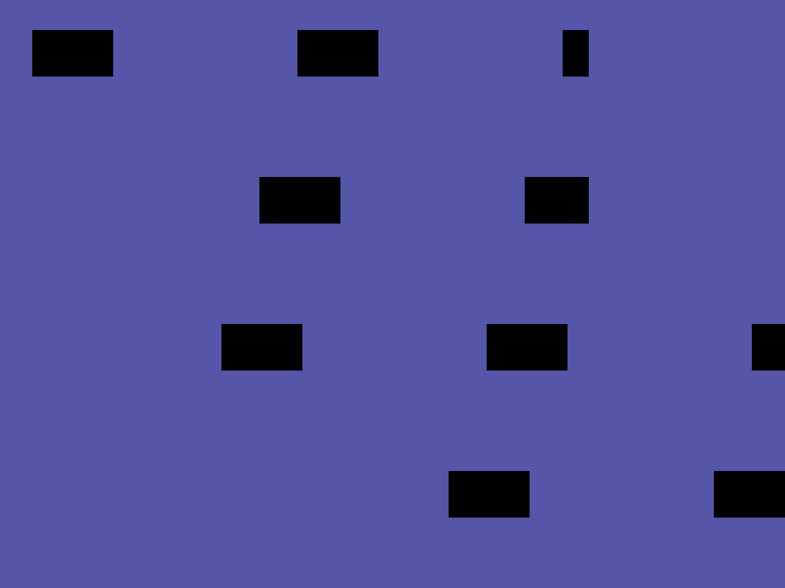
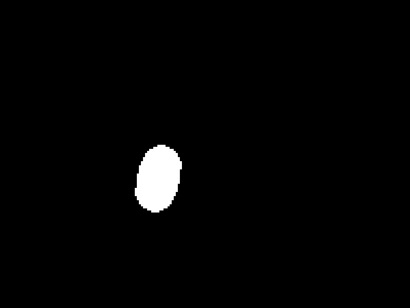
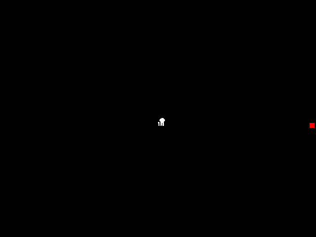

# Tiny Tapeout VGA videos

Simulate every Tiny Tapeout project that matches the Tiny VGA Pmod pinout,
decode the VGA output, and produce 10, 30 and 60 second videos of what the
design shows. Videos that come out wrong are examined by an AI agent to work
out whether the project, the stimulus or the harness is at fault.

Project list and metadata come from
[tinytapeout-project-search](https://github.com/mithro/tinytapeout-project-search);
the simulator conventions come from the
[Tiny Tapeout VGA Playground](https://github.com/TinyTapeout/vga-playground).

Status: design under review. See `PROGRESS.md` for the work log and
`docs/superpowers/specs/2026-09-15-vga-videos-design.md` for the design.

Simulations run on a remote host under a dedicated unprivileged user; see
`docs/host-setup.md`. The repository never names the host.

## What comes out

Per project: `60s.avi`, `30s.avi`, `10s.avi` (MJPEG, native resolution,
the measured frame rate), `poster.png` (a frame from 5 s in) and
`contact.png` (16 frames across the clip). Examples from the pilot:

| Sushi demo (ttcad25a), contact sheet | Metaballs (tt08), poster | Not a dinosaur (ttihp26a), poster |
| --- | --- | --- |
|  |  |  |

The current counts per verdict and shuttle are in [docs/status.md](docs/status.md).

## Usage

```
uv run tt-vga targets                   # data/targets.json from the project-search data
uv run tt-vga host-check --host NAME    # NAME from ~/.config/tinytapeout-vga-videos/config.toml, or user@host
uv run tt-vga bootstrap  --host NAME    # install the pinned toolchain into the host user's home
uv run tt-vga sync       --host NAME    # copy harness, targets and overrides
uv run tt-vga queue start --host NAME --jobs 40 [--only tt08,ttsky26a/tt_um_x] [--redo]
uv run tt-vga queue status|stop|kill --host NAME
uv run tt-vga collect    --host NAME    # pull result.json files into data/results/
uv run tt-vga analyze                   # verdict per project
uv run tt-vga report                    # docs/status.md and data/status.json
```

The queue runs in a `tmux` session on the host and can be stopped and
restarted at any time; finished projects are skipped unless `--redo` is
given. Per-project tweaks (clock, inputs, gamepad buttons, extra Verilator
flags, source patches, skip) go in `overrides/<shuttle>/<macro>.yaml`; the
format is documented at the top of `ttvga/overrides.py`.

When the default all-low inputs give no raster, the job runner probes each
single `ui_in` bit with a short calibration run and uses the first one that
syncs (recorded as `auto_ui_in` in the result).

### Asking an agent why a video is wrong

```
uv run tt-vga collect --host NAME --images tmp/review   # posters and contact sheets for the bundle
uv run tt-vga diagnose tt06/tt_um_x --images tmp/review # local Claude Code CLI, structured answer
uv run tt-vga diagnose tt06/tt_um_x --images tmp/review --apply   # also write the proposed override
```

The agent gets the project's documentation, its sources at the taped-out
commit, the harness, the result and timing data and the images, and answers
with a cause (wrong inputs, wrong clock, needs stimulus, static by design,
not VGA, project broken, harness bug, tool limitation), evidence, and an
optional override. Every answer is appended to the project's `result.json`
and its cost to `data/diagnosis_usage.jsonl`. This is used by hand while
the pipeline is being developed; a pass over every failure is a later step.

## Decisions so far

- Phase 1 is RTL simulation with Verilator; gate-level simulation is phase 2.
- Videos, posters and contact sheets stay on the simulation host for now; a
  few examples are committed for documentation. Long-term hosting and
  YouTube (with title card and outro) come later.
- Static output counts as a success that may need more stimulus.
- Automated AI diagnosis of every failure is a late step and is only run
  after discussion; ad hoc diagnosis is used while developing.

## Licence

Apache 2.0. Project sources and documentation belong to their authors.
